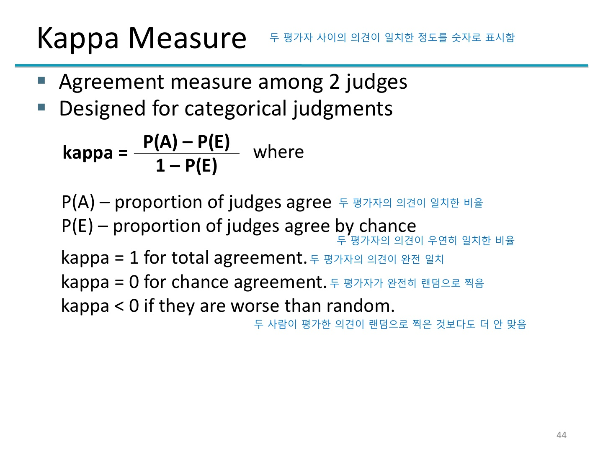
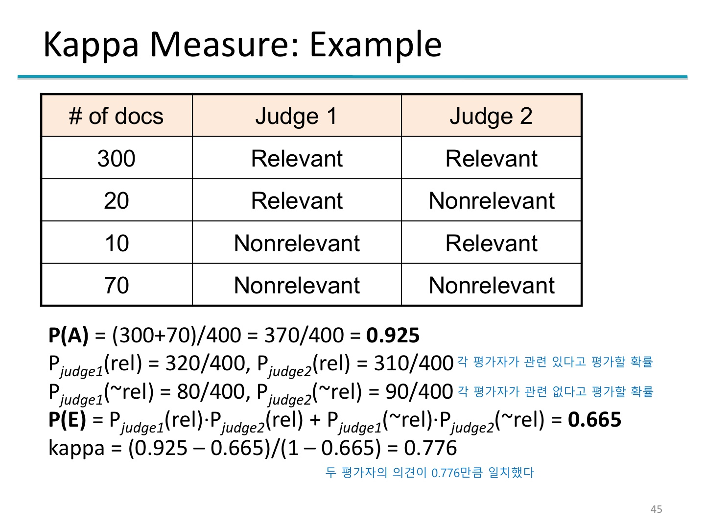
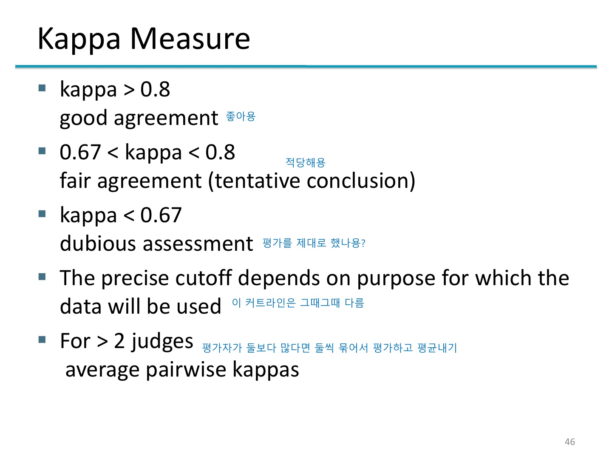

<!--

[<a id="" href="">1</a>] #
[<a id="" href="" title="">2</a>] #, <a href="#" target="_blank">#</a>

<figure>
    
    <figcaption>#</figcaption>
</figure>

    
#

    <figure>
        
        <figcaption>#</figcaption>
    </figure>

-->

## 알림
모든 이미지의 출처는 "정보 검색" 강의 자료이다.

## 9주
주제 : 질의어-문서 계산 빠르게 하는 법  
- 코사인 점수 계산 줄이는 방법 : 문서별 계산 X, 단어별로 계산하기, 0은 곱하지 않기
  
### 코사인 점수 랭킹 효과적으로 골라내기
**검색 결과를 반환할 때는 코사인 점수가 높은 k개의 문서를 찾아줘야 한다. 전체 문서가 아주 많으면 코사인 점수를 정렬하는 것도 일이다.**  
- 더 빠른 코사인 점수 : 가중치 없는 쿼리 계산 안 하기.
- 상위 k개 문서 효과적으로 고르기 : 힙 사용. 노드 1백만 개, 결과 문서 100개라고 치면 전체 정렬과 비교해서 연산 횟수가 60만:20만 정도로 차이남.
- 대충 고르기 : 덜 정확하지만(코사인 점수도 정확한 거 아니니까 상관 없음) 빠름. 먼저 검색 대상 그룹을 한정하고(전체 문서 수보다는 적지만 필요한 결과 수보다는 많게) 그 안에서만 고름. 추려낸 문서는 실제 상위 k개 문서를 포함하지 않을 수 있지만 가능성은 높다고 봄. 아래는 검색 대상 그룹을 한정하는 방법들
	1. Index elimination : 질의로 들어온 단어 중 최소 하나 이상이 포함된 문서만 추리기. 아래는 추가로 추리는 방법.
		- idf가 높은 단어만 검색하기 : idf가 낮은 건 별로 안 중요한 단어다. 흔한 단어의 idf는 작아서 전체 점수에 큰 영향을 못 준다.
		- 전체 질의에서 몇 개 이상이 포함된 문서만 골라 검색하기
	2. Champion lists : tf 기준 상위 r(> k)개의 문서. 인덱싱할 때 미리 만들어둠.
	3. Static quality scores : 문서의 권위를 수치화(문서의 권위: 얼마나 믿을만한 문서인지). 질의와 무관하니 static함. 챔피언 리스트와 결합 가능
	4. Impact ordering : 모든 문서를 wt,d 순으로 정렬 (wt,d는 tf \* idf). 이 정렬로 상위 k개 문서 고르는 방법 2가지
		- 조기종료 : 검색 도중 정해진 개수의 문서를 다 봤거나, wt,d가 미리 정해둔 값보다 떨어지면 검색하지 말자
		- idf순 단어 : idf 값이 미리 정해진 값보다 큰 것만 계산하자. Index elimination에도 적용 가능
	5. Cluster pruning(가지치기)
		- 전처리 : 전체 문서 중 √n개 추출해(랜덤 샘플링) 리더 임명 후 유사도 계산해 비슷한 것끼리 군집화
		- 쿼리 전처리 : 질의와 리더들의 유사도 계산 후 유사도가 높은 클러스터만 검색
		- General variants : 전처리 단계에서 각 팔로워가 여러 리더를 따르도록 처리, 질의를 처리할 때 여러 개의 클러스터에 대해 검색하도록 함 → 결과가 정확해질 가능성이 높아지지만 계산량 많아짐
- Tiered indexes : 포스팅 리스트를 둘 이상의 티어로 나누어 생성, 높은 티어부터 검색. 티어는 인덱스 생성 시 분류함.
- Query parsers : 사용자가 free text로 검색하면 파서가 1개 이상의 쿼리 생성해 검색, 다 해봐도 안 되면 벡터 검색
- Aggregate scores : 여러 방식으로 검색한 결과의 score 합치기. 전문가가 튜닝하거나 기계학습 이용.
- Vector Space Model vs Boolean Model : 벡터 모델의 인덱스는 불린 모델 검색에도 사용 가능, 역은 불가능

## 10주
주제 : 정보 검색 시스템 평가하기  
- 검색 엔진 평가 기준  
	대부분 요소는 양적 평가 가능
	- 사용자 만족도 측정 : 일반적으로 만족도 평가는 어려우니 검색 결과와 원하던 결과의 관련성을 평가에 이용함
		- 웹 : 사용자가 원하는 정보를 찾으면, 사용자는 다음에 또 쓴다. → 재사용 사용자의 비율로 평가 가능
		- 쇼핑 사이트 : 쇼핑몰 운영자를 만족시켜야 한다(돈 주니까). 구매자가 원하는 물건을 잘 찾을 수 있는지, 구매하기까지 걸리는 시간, 검색자와 구매자의 비율(검색만 하고 가는 사람)
		- 기업 내부망 검색 엔진 : 회사/정부/학교 등에서 사용, 얼마나 사용자의 생산성을 높일 수 있는지
	- 연관성 판단 : "원하는 정보"가 제대로 나왔는지.
- 정보 검색 시스템 평가를 위한 테스트셋  
	문서 집합과 질의/해당 문서 조합인 테스트셋 필요. 문서의 양에 따라 모든 문서에 정답이 표기되지 않을 수 있음. 여러 개의 테스트 질의로 평균냄.
	- Cranfield Collection
	- TREC (Text REtrieval Conference)
	- GOV2
	- NTCIR (NII Test Collections for IR systems)
	- REUTERS-21578 and Reuters-RCV1
	- 20 Newsgroups
- 검색 결과에 순서가 없는 모델의 평가 방법
	- 정확도 : 전체 문서 중 질의와의 관련성을 맞힌 것의 비율. 수많은 문서 중 관련 있는 몇 개만을 검색하기 때문에 '관련 없음 - 관련 없음' 정답이 너무 많아서 정확도가 너무 높게 나옴. 심지어 아무 검색 결과도 안 나와도 정확도는 99.9% 가능.  
		사람들은 쓰레기가 좀 섞여도 뭔가를 찾아주긴 하는 검색 엔진을 원한다.
	- || **관련 있음** | **관련 없음**
		|-|-|-|
		**검색 됨** | true positive(tp) | false positive(fp)
		**검색 안 됨** | false negative(fn) | true negative(tn)
	- 정밀도 : `검색된 관련 있는 문서 / 검색 결과`, P = tp / (tp + fp)
	- 재현율 : `검색된 관련 있는 문서 / 문서 집합 중 관련 있는 문서`, R = tp / (tp + fn)
	- 정밀도 vs 재현율 : 검색 결과에서 원하는 답을 빨리 찾고 싶다면(일반인) 정밀도, 딱 원하는 문서가 있기만 하면 된다면(전문가) 재현율이 높아야 한다.
- 검색 결과에 순서가 있는 모델의 평가 방법
	1. Interpolated(보간된) Precision : 특정 재현율에서, 재현율을 증가시켰을 때 얻을 수 있는 정밀도의 최댓값을 취함  

		<figure>
			
			<figcaption>[이미지 1] Interpolated Precision</figcaption>
		</figure>

	2. 11-point Interpolated Average Precision
		1. 재현율을 0부터 1까지 0.1 단위로 끊어 11개의 점 준비
		2. 그 11개의 점에 대한 최대 정밀도(interpolated P) 구함
		3. 위 과정을 각 질의어마다 수행함
		4. 그 산술평균을 구함
		- 예를 들어 50개의 질의가 있다면 50번 * 11개 정밀도 구하고 평균
	3. Mean Average Precision (MAP)  
		전체 질의 집합 Q에 속하는 어떤 질의 q와, q와 관련된 문서 집합(d1, d2, ..., dm)에 대해  
		각 문서가 검색 결과에 나오는 경우의 정밀도를 계산(d1이 나올 때 정밀도 ~ dm이 나올 때 정밀도)  
		그 모든 정밀도의 합을 구하고 관련 문서 집합의 크기(m)로 나눔  
		이 과정을 Q에 속하는 모든 질의에 대해 반복하고 Q의 크기로 나눔  
		→ 평균의 평균을 구하는 정밀도  

		<figure>
			
			<figcaption>[이미지 2] Mean Average Precision 식</figcaption>
		</figure>

		이 방법은 여러 개의 시스템을 서로 비교할 때 주로 사용한다. 하나의 시스템을 평가하는 데에는 별로 적절하지 않다.

	4. R-precision : 주어진 질의와 관련된 문서가 몇 개인지 미리 알고 있어야 사용 가능한 방법  
		주어진 질의와 관련된 문서의 개수가 검색 결과의 최대 개수가 된다. 예를 들어 10개의 문서가 관련되었다고 한다면 검색 결과를 10개로 제한.  
		그중 실제로 관련 있는 문서의 비율을 본다(정밀도를 계산한다)  
		이 정의에 의해, R 정밀도는 재현율과 같다.  
	5. Precision at k  
		벡터 모델에서 k개를 검색했을 때 관련 있는 문서가 몇 개 있는지 보는 방법. R 정밀도와 다른 점은 검색 결과의 수인 k를 사용자 마음대로 정한다는 것.  
		질의에 따라 관련 있는 문서의 수가 다르지만 그것을 무시하므로 그다지 적절한 평가 방법이 아니다.  
- 다른 평가 방법
	1. Interjudge Agreement(상호 평가) : 사람이 검색 결과의 적절성을 직접 평가(안 할 수는 없음). 하지만 사람의 평가는 개인차가 크니 두 사람씩 조합해 평균값을 지표로 사용한다.  
		일정한 테스트셋을 만들어서 매번 재사용한다(시간과 노동력 절약)
		- Kappa Measure : 두 평가자 사이의 의견이 일치한 정도를 숫자로 표시한다.  

			

				
Kappa Measure 강의자료 보기

				<figure>
					
					<figcaption>Kappa Measure 강의자료 1</figcaption>
				</figure>
				<figure>
					
					<figcaption>Kappa Measure 강의자료 2</figcaption>
				</figure>
				<figure>
					
					<figcaption>Kappa Measure 강의자료 3</figcaption>
				</figure>
			

## 참고
&#91;1&#93; 마크다운 - 표(테이블) 만들기, <a href="https://inasie.github.io/it%EC%9D%BC%EB%B0%98/%EB%A7%88%ED%81%AC%EB%8B%A4%EC%9A%B4-%ED%91%9C-%EB%A7%8C%EB%93%A4%EA%B8%B0/">https://inasie.github.io/it일반/마크다운-표-만들기/</a>
